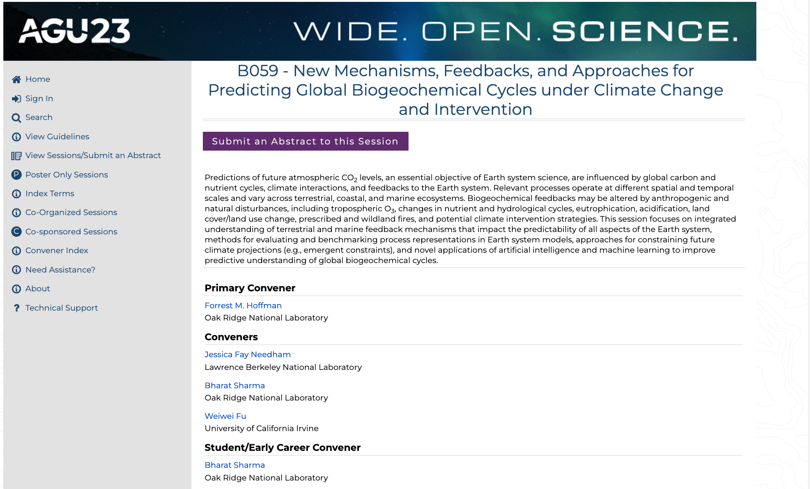

|Date|Place|
|---|---|
| Jul 25, 2024| Oak Ridge, TN, USA|
|---|---|
|Our paper, “[Carbon cycle extremes accelerate weakening of the land carbon sink in the late 21st century](https://doi.org/10.5194/bg-20-1829-2023)” was cited in the New
Scientist article “[One of Earth's major carbon sinks collapsed in 2023](https://www.newscientist.com/article/2440453-one-of-earths-major-carbon-sinks-collapsed-in-2023/)”.
||
|---|---|
| | |
| Mar 19, 2024| Oak Ridge, TN, USA|
|---|---|
|Our paper, ``Quantifying Carbon Cycle Extremes and Attributing Their Causes Under Climate and Land Use & Land Cover Change from 1850 to 2300'' [https://doi.org/10.1029/2021JG006738] was among the most downloaded article. (https://agupubs.onlinelibrary.wiley.com/doi/10.1029/2021JG006738). ||
|---|---|
| | |
| Dec 15, 2023| San Francisco, CA, USA|
|---|---|
|Presented my paper “[Investigating the CO2 Response of Secondary-Succession Forests at Duke and Oak Ridge FACE Experiments Simulated with ELM-FATES-CNP](https://doi.org/10.5194/bg-2022-178)” in Amercian Geophysical Union 2023 annual meeting in San Francisco, CA. #AGU2023. | |
|---|---|
| | |
| Sep 14, 2023| Oak Ridge, TN, USA|
|---|---|
|Stroy published highlighting our work: [**Compound events like wildfires, droughts weaken carbon sink**](https://www.ornl.gov/news/modeling-climate-extremes)| |
|---|---|
| | |
| Aug 02, 2023| Singapore|
|---|---|
|Gave an oral presentation on "Comparative Analysis of Climate-driven Carbon Cycle Extremes Using Observations and CMIP6 Earth System Models" in Annual Meeting of the Asia Oceania Geosciences Society (AOGS), 30 July–4 Aug 2023, SUNTEC, Singapore.| |
|---|---|
| | |
| Jul 04, 2023| Oak Ridge, TN, USA|
|---|---|
|Consider submitting your abstract to “[B059 - New Mechanisms, Feedbacks, and Approaches for Predicting Global Biogeochemical Cycles under Climate Change and Intervention](https://agu.confex.com/agu/fm23/prelim.cgi/Session/190931)” in American Geophyisical Union 2023 in San Francisco (Dec 11-15, 2023)| |
|---|---|
| | |
| Jun 28, 2023| Oak Ridge, TN, USA|
|---|---|
|Completed the course “Introduction to Fortran”! #fortran #LinkedInLearning| |
|---|---|
| | |
| May 22, 2023| Oak Ridge, TN, USA|
|---|---|
|Our Paper “[Carbon cycle extremes accelerate weakening of the land carbon sink in the late 21st century](https://doi.org/10.5194/bg-20-1829-2023)” got published.| |
|---|---|
| | |
| May 16, 2023| Bethesda, MD, USA|
|---|---|
|Presented poster titled “[Investigating the CO2 Response of Secondary-Succession Forests at Duke and Oak Ridge FACE Experiments Simulated with ELM-FATES-CNP](https://www.anthromes-co2-and-terrestrial-carbon.com/2023/en/node/speakerprofile-bharat-sharma-oak-ridge-national-laboratory)” in the [2023 ESS PI Meeting](https://ess.science.energy.gov/pi-meeting/) symposium in Bethesda, MD, USA. May 16-17, 2023.| |
|---|---|
| | |
| Mar 27, 2023| Potomac, MD, USA|
|---|---|
|Presented poster titled “[Investigating the CO2 Response of Secondary-Succession Forests at Duke and Oak Ridge FACE Experiments Simulated with ELM-FATES-CNP](https://www.anthromes-co2-and-terrestrial-carbon.com/2023/en/node/speakerprofile-bharat-sharma-oak-ridge-national-laboratory)” in the [Anthromes, CO2, and Terrestrial Carbon](https://www.anthromes-co2-and-terrestrial-carbon.com/2023/en/page/home) symposium in Potomac, MD, USA. Mar 27-31, 2023.| |
|---|---|
| | |
| Mar 8, 2023| Knoxville, TN, USA|
|---|---|
|Took an invited [lecture/tutorial](https://github.com/sharma-bharat/Tutorials_by_Bharat/blob/main/UTK_2023.ipynb) in UTK to teach students how to access the CMIP6 data and use Python to analyze the simulation outputs. | |
|---|---|
| | |
| Feb 10, 2023| Oak Ridge, TN, USA|
|---|---|
|Our Paper “[Using Image Processing Techniques to Identify and Quantify Spatiotemporal Carbon Cycle Extremes](https://doi.org/10.1109/ICDMW58026.2022.00148)” became online.| |
|---|---|
| | |
| Jan 9, 2023| Denver, CO, USA|
|---|---|
|Presented poster titled “[Increased Intensity of Carbon Cycle Extremes Driven by Land Use and Land Cover Change (Poster ID 45)](https://doi.org/10.1029/2021JG006738)” in Amercian Meteorological Society’s 36th Conference on Climate Variability and Change in Denver, CO. #AMS2023.| |
|---|---|
| | |
| Dec 16, 2022| Chicago, IL, USA|
|---|---|
|Pragya received Best Student Presenter award for the her work in Drought susceptibility across different natural biomes in AGU fall meeting 2022 in Chicago.| |
|---|---|
| | |
| Dec 15, 2022| Chicago, IL, USA|
|---|---|
|Presented my paper “[Carbon Cycle Extremes Accelerate Weakening of the Land Carbon Sink in the Late 21st Century](https://doi.org/10.5194/bg-2022-178)” in Amercian Geophysical Union 2022 annual meeting in Chicago, IL. #AGU2022. | |
|---|---|
| | |
| Dec 6, 2022| Oak Ridge, TN, USA|
|---|---|
|Participated in the Hour of Code event in partnership with ORNL and interacted with 4th graders from Woodland Elementary School. The students created games at [hourofcode](https://hourofcode.com/us/learn). #HourOfCode @ORNL @ORNLCommunity. | |
|---|---|
| | |
| Nov 28, 2022| Orlando, FL, USA|
|---|---|
|Presented my recent paper titled “[Using Image Processing Techniques to Identify and Quantify Spatiotemporal Carbon Cycle Extremes](./papers/Sharma_2022_SpatioTemporalExtremes_ICDM.pdf)” at the 10th Workshop on Data Mining in Earth System Science (DMESS 2022), IEEE International Conference on Data Mining Workshops (ICDMW 2022) in Orlando, FL, USA. ||
|---|---|
| | |
| Aug 31, 2022| Oak Ridge, TN, USA|
|---|---|
|Defended my Ph.D. titled “[Analysis Of Global Carbon Cycle Extremes, Their Compound Climate Drivers, And Implications For Terrestrial Carbon Cycle.](./papers/Sharma_PhD_Dissertation.pdf)” ||
|---|---|
| | |
