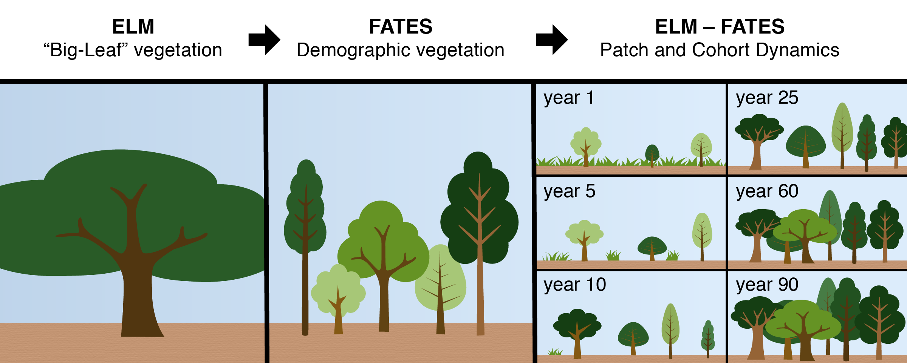

My research is at the intersection of Data Science and Earth science, and high-performance computing. I am interested in analyzing spatio-temporal extremes in carbon fluxes using Observations and Earth System Models to quantify the impact of climate change on potential carbon uptake and carbon sink.

## Bio
Bharat Sharma is a [Postdoctoral Research Associate](https://www.ornl.gov/staff-profile/bharat-d-sharma) in Ecosystem Processes Group at Environmental Sciences Division, [Oak Ridge National Laboratory](https://www.ornl.gov/). 
I am working on the challenge of modeling forest stand CO2 interactions with nutrients in the demographically enabled ELM-FATES.
Bharat Sharma has a Ph.D. in Interdisciplinary Engineering (Department of Civil and Environmental Engineering) at [Northeastern University](https://www.northeastern.edu/), Boston. He has worked as an exchange graduate student at the Climate Change Science Institute at Oak Ridge National Laboratory with a concentration in understanding the impact of changing climate on the terrestrial carbon cycle. His Ph.D. focused on the detection of extreme events in carbon fluxes, under various forcing scenarios using observations and earth system models, and attribution to individual and compound climate drivers. He has a Master’s in Transportation System from the [Technical University of Munich (Germany)](https://www.tum.de/en/) and a Bachelor’s in Civil Engineering from the [National Institute of Technology, Hamirpur (India)](https://nith.ac.in/). He has previously worked at [Obermeyer](https://www.obermeyer-group.com/) and [New Delhi International Airport](https://www.newdelhiairport.in/). Bharat spends his spare time cooking, reading, and talking to friends and family.

 

 

 

## Improving the vegetation representation in the Earth system models.

See: [climatemodeling.science.energy.gov/.../fates](https://climatemodeling.science.energy.gov/technical-highlights/fates-e3sm-functionally-assembled-terrestrial-ecosystem-simulator)

{:width="95%"}

