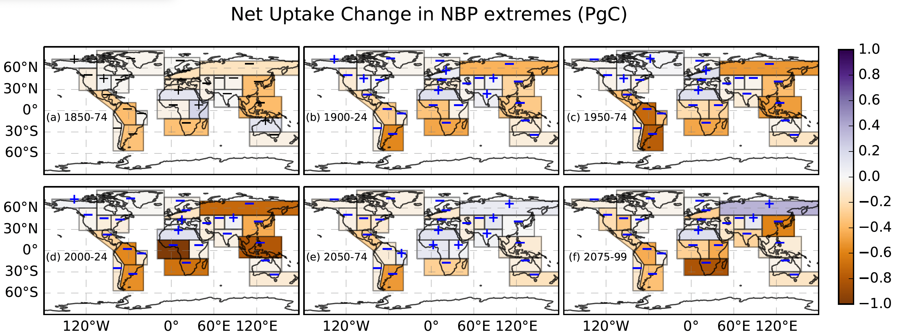
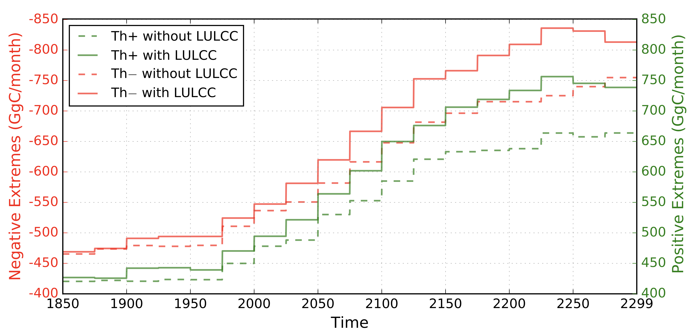
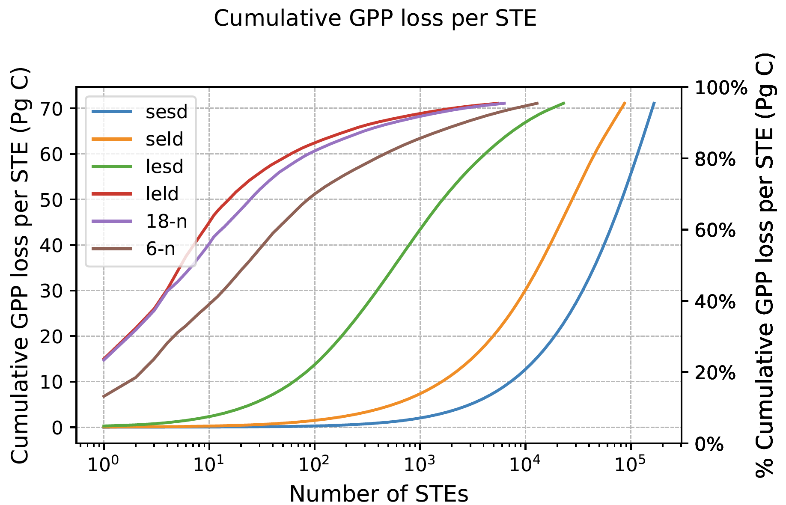
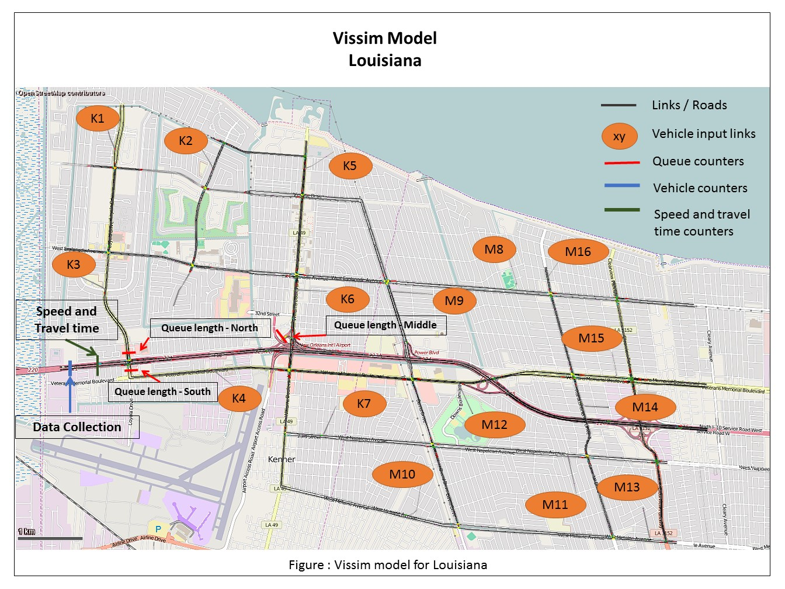
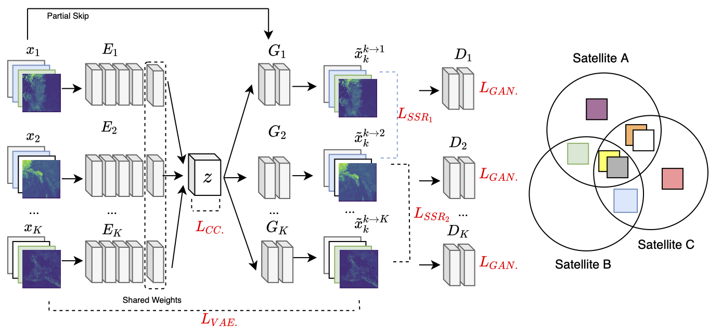
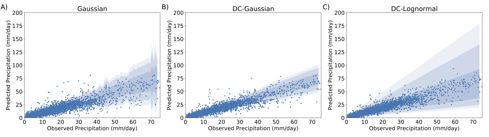
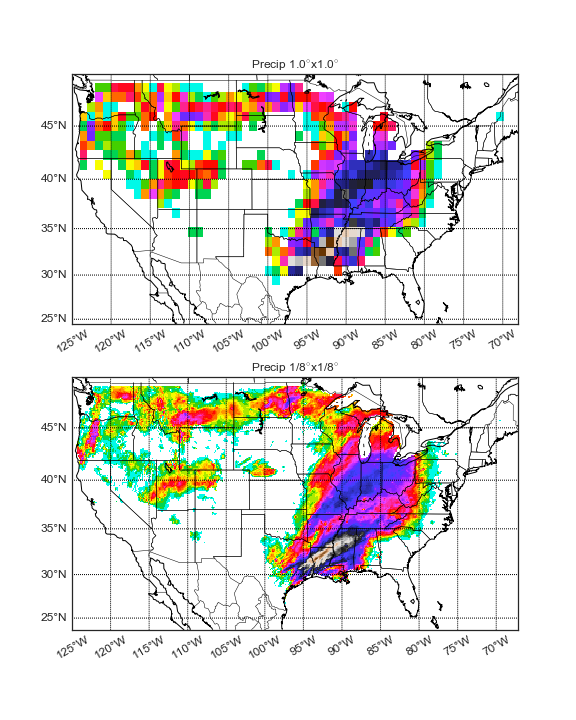

## Carbon cycle extremes accelerate weakening of the land carbon sink in the late 21st century

**Authors:** Bharat Sharma, Jitendra Kumar, Auroop Ganguly, and Forrest M. Hoffman   
**Abstract:** Increasing surface temperature could lead to enhanced evaporation, reduced soil moisture availability, and more frequent droughts and heat waves. The spatiotemporal co-occurrence of such effects further drives extreme anomalies in vegetation productivity and net land carbon storage. However, the impacts of climate change on extremes in net biospheric production (NBP) over longer time periods are unknown. Using the percentile threshold on the probability distribution curve of NBP anomalies, we computed negative and positive extremes in NBP. Here we show that due to climate warming, about 88 % of global regions will experience a larger magnitude of negative NBP extremes than positive NBP extremes toward the end of 2100, which accelerate the weakening of the land carbon sink. Our analysis indicates the frequency of negative extremes associated with declines in biospheric productivity was larger than positive extremes, especially in the tropics. While the overall impact of warming at high latitudes is expected to increase plant productivity and carbon uptake, high-temperature anomalies increasingly induce negative NBP extremes toward the end of the 21st century. Using regression analysis, we found soil moisture anomalies to be the most dominant individual driver of NBP extremes. The compound effect of hotness, dryness, and fire caused extremes at more than 50 % of the total grid cells. The larger proportion of negative NBP extremes raises a concern about whether the Earth is capable of increasing vegetation production with a growing human population and rising demand for plant material for food, fiber, fuel, and building materials. The increasing proportion of negative NBP extremes highlights the consequences not only of reduction in total carbon uptake capacity but also of conversion of land to a carbon source.  

**Paper:** [Biogeosciences (2023)](https://doi.org/10.5194/bg-20-1829-2023)  
**Highlights:** [EESM Project Highlights](https://climatemodeling.science.energy.gov/research-highlights/)  

## Quantifying Carbon Cycle Extremes and Attributing Their Causes Under Climate and Land Use and Land Cover Change From 1850 to 2300

**Authors:** Bharat Sharma, Jitendra Kumar, Nathan Collier, Auroop Ganguly, and Forrest M. Hoffman   
**Abstract:** The increasing atmospheric carbon dioxide (CO2) mole fraction affects global climate through radiative (trapping longwave radiation) and physiological effects (reduction of plant transpiration). We use the simulations of the Community Earth System Model (CESM1-BGC) forced with Representative Concentration Pathway 8.5 to investigate climate-vegetation feedbacks from 1850 to the year 2300. Human-induced land use and land cover change (LULCC), through biogeochemical and biogeophysical processes, alter the climate and modify photosynthetic activity. The changing characteristics of extreme anomalies in photosynthesis, referred to as carbon cycle extremes, increase the uncertainty of terrestrial ecosystems to act as a net carbon sink. However, the role of LULCC in altering carbon cycle extremes under business-as-usual (continuously rising) CO2 emissions is unknown. Here we show that LULCC magnifies the intensity, frequency, and extent of carbon cycle extremes, resulting in a net reduction in expected photosynthetic activity in the future. We found that large temporally contiguous negative carbon cycle extremes are due to a persistent decrease in soil moisture, which is triggered by declines in precipitation. With LULCC and global warming, vegetation exhibits increased vulnerability to hot and dry environmental conditions, increasing the frequency of fire events and resulting in considerable losses in photosynthetic activity. While most regions show strengthening of negative carbon cycle extremes, a few locations show a weakening effect driven by declining vegetation cover or benign climate conditions for photosynthesis. Increasing hot, dry, and fire-driven carbon cycle extremes are essential for improving carbon cycle modeling and estimation of ecosystem responses to LULCC and rising CO2 mole fractions. Moreover, large aberrations in vegetation productivity represent potential and growing threats to human lives, wildlife, and food security.  

**Paper:** [JGR Biogeosciences (2022)](https://doi.org/10.1029/2021JG006738)  
**Highlights:** [EESM Project Highlights](https://climatemodeling.science.energy.gov/research-highlights/land-use-change-intensifies-negative-carbon-cycle-extremes)  

## Using Image Processing Techniques to Identify and Quantify Spatiotemporal Carbon Cycle Extremes

**Authors:** Bharat Sharma, Jitendra Kumar, Auroop Ganguly, and Forrest M. Hoffman   
**Abstract:** Rising atmospheric carbon dioxide due to human activities through fossil fuel emissions and land use changes have increased climate extremes such as heat waves and droughts that have led to and are expected to increase the occurrence of carbon cycle extremes. Carbon cycle extremes represent large anomalies in the carbon cycle that are associated with gains or losses in carbon uptake. Carbon cycle extremes could be continuous in space and time and cross political boundaries. Here, we present a methodology to identify large spatiotemporal extremes (STEs) in the terrestrial carbon cycle using image processing tools for feature detection. We characterized the STE events based on neighborhood structures that are three-dimensional adjacency matrices for the detection of spatiotemporal manifolds of carbon cycle extremes. We found that the area affected and carbon loss during negative carbon cycle extremes were consistent with continuous neighborhood structures. In the gross primary production data we used, 100 carbon cycle STEs accounted for more than 75% of all the negative carbon cycle extremes. This paper presents a comparative analysis of the magnitude of carbon cycle STEs and attribution of those STEs to climate drivers as a function of neighborhood structures for two observational datasets and an Earth system model simulation.  

**Paper:** [IEEE ICMDW (2022)](https://doi.org/10.1109/ICDMW58026.2022.00148)  

## Resilience in Urban Areas : An Approach to Study Interaction between Evacuation and Land Use & Transportation Structures

**Authors:** Bharat Sharma and Benjamin Buettner  
**Abstract:** The usage of the word resilience in the last decade has tremendously increased in several fields, including the field of urban planning. Generally understood as capacity to absorb and bounce back; resilience aims to prepare a person or a city for uncertainties, shocks, and stresses.
The development of urban structure varies across the world. Recently increased awareness regarding environmental and air quality has attested the advantages of Transit Oriented Development over Transit Adjacent or Automobile-Oriented devel- opment.
In this thesis, an attempt to analyze the response of cities with different land use structure when stuck with warning based disaster has been made. Therefore, same transport infrastructure and supply has been modeled so as to generate results close to the reality. Different parameters - for instance, evacuation time, queue lengths, vehicle travel time, average delay time, and average speed - were analyzed.
The quantitative analysis using VISSIM 7 software confirmed the hypothesis that transit oriented developments if faced with a shock, perform better than car dependent city structure.  
**Report:** [Master Thesis (2016)](./papers/Sharma_masterthesis_TUM_2016.pdf)  
**Simulation:** [Congestion on Evacuation Paths](https://drive.google.com/file/d/1RmKv6HtWiJtIxZzoLH1_aY79XTkZlVrm/view?usp=sharing)

## Characteristics of Soil, Sand, Fly ash, and Ceramix Mix for Use as Subgrade Material

**Authors:** Bharat Sharma, Abhishek Sharma, Tushar Khandelwal, Neelmani Singh, Ashish Parmar, and R. K. Sharma  
**Abstract:** The most concerning problem today with the Thermal power plant is the disposal of Fly ash. The use of Fly ash as landfill causes great environmental pollution like, groundwater contamination, since coal contains trace levels of heavy metals. Similarly, waste ceramic too causes great environmental problem. So, there is a need to utilize these materials by exploiting their inherent properties to solve the environment and disposable problem. This report brings out the results of an experimental programme carried out to evaluate the effectiveness of using Fly ash with randomly distributed discrete waste ceramic for soil stabilization by studying the compaction and strength characteristics for use as subgrade material. The influence of different mix proportions of Clay, Sand, Fly ash and Ceramic on compaction, drainage and CBR values has been studied. The results show that addition of Fly ash increases the OMC and decreases the MDD, but increased the CBR. The designed composite may be used effectively for construction of subgrade, embankment and foundations of low cost roads. 
**Report:** [UG Major Project 2 (2012)](./papers/UG_Major_2.pdf)  
**Journal Publication:** [Recent Trends in Civil Engineering & Technology (2013)*](./papers/Characteristic_paper_UG.pdf)  

## Comparitive Analysis of Commercially Available Software Tools for Slope Stability and Simulation of Dynamic Loading

**Authors:** Bharat Sharma, Abhishek Sharma, Rounak Maheswari, Tushar Khandelwal, and R. K. Sharma  
**Abstract:** Analysis of slope stability is carried out to identify the most critical failure plane so as to minimize the occurrence of slope failures and landslides. It is always needed to give serious consideration before any construction or development is executed to ensure that the designed slopes remain stable. Slope failure can be determined through appropriate measurement of slope stability. In this study C-programming and GEO4 and Plaxis 2D software have been used to determine the factor of safety of the selected slope. Total station surveying has been used to prepare contour maps of the study area using LISCAD. The parameters such as soil cohesion (c), angle of internal friction (φ), and unit weight of soil (γ) have been determined using laboratory experiments. The site is modeled as multilayer so as to simulate real conditions as close as possible. The simulation involving dynamic loading as the site is subjected to mild earthquakes is also incorporated. The study is conducted for a site where the mode of failure is analyzed using Bishop’s method and appropriate preventive measure for slope stability is recommended and detailed design is provided. 
**Report:** [UG Major Project 1 (2011)](./papers/UG_Major_1.pdf)  
**Journal Publication:** [Recent Trends in Civil Engineering & Technology (2013)*](./papers/Comparative_paper_UG.pdf)  

## Selected Class Projects
[Investigating Resiliency of U.S. Airlines Network (2016)](./presentations/Sharma_Warner_CNFinalPresentation.pdf) by Bharat Sharma and Lizzy Warner.   

[Overview of Public Transportation in the City Chandigarh, India (2015)](./presentations/Local_Public_Transportation_Chandigarh.pdf) by Bharat Sharma  

[Dynamics of Air Transport:  There is more to it than just Flying (2014)](./presentations/Dynamics_of_Air_Transport.pdf) by Bharat Sharma  

[Third Runway at Munich Airport: Planning, Protests and Progressn (2014)](./presentations/Runway_Three_Munich.pdf) by Bharat Sharma  

[Accessibility to Primary Education with respect to Fuel Price Hikes (2014)](./presentations/Sharma_Accessibility.jpg) by Bharat Sharma  

[Congestion Pricing in the city of London (2014)](./presentations/Congestion_Prising_Case_Study_London.pdf) by Bharat Sharma, Aslam Zuhair, Karakikes Ioannis, Karatsoli Maria, Keen Umair Hamid, and Politi Stamatia  

_* Name changed in 2016_

<!---
## Spectral Synthesis for Geostationary Satellite-to-Satellite Translation

**Authors:** Thomas Vandal, Daniel McDuff, Weile Wang, Kate Duffy, Andrew Michaelis, and Rama Nemani  
**Abstract:** Earth-observing satellites carrying multispectral sensors are widely used to monitor the physical and biological states of the atmosphere, land, and oceans. These satellites have different vantage points above the Earth and different spectral imaging bands resulting in inconsistent imagery from one to another. This presents challenges in building downstream applications. What if we could generate synthetic bands for existing satellites from the union of all domains? We tackle the problem of generating synthetic spectral imagery for multispectral sensors as an unsupervised image-to-image translation problem modeled with a variational autoencoder (VAE) and generative adversarial network (GAN) architecture. Our approach introduces a novel shared spectral reconstruction loss to constrain the high-dimensional feature space of multispectral images. Simulated experiments performed by dropping one or more spectral bands show that cross-domain reconstruction outperforms measurements obtained from a second vantage point. Our proposed approach enables the synchronization of multispectral data and provides a basis for more homogeneous remote sensing datasets.  
**Journal Publication:** [IEEE Transactions on Geoscience and Remote Sensing (TGRS)](https://ieeexplore.ieee.org/document/9462910)  
**Code:** [https://github.com/tjvandal/unsupervised-spectral-synthesis](https://github.com/tjvandal/unsupervised-spectral-synthesis)

## Temporal Interpolation of Geostationary Satellite Imagery With Optical Flow

<iframe width="560" height="315" src="https://www.youtube.com/embed/NeMXPQw3CJU?controls=0" frameborder="0" allow="accelerometer; autoplay; encrypted-media; gyroscope;" allowfullscreen></iframe>
  
**DeepSpatial 2020 Best Spotlight Presentation**  
**Authors:** Thomas Vandal & Rama Nemani  
**Abstract:** Applications of satellite data in areas such as weather tracking and modeling, ecosystem monitoring, wildfire detection, and landcover change are heavily dependent on the trade-offs related to the spatial, spectral and temporal resolutions of the observations. For instance, geostationary weather tracking satellites are designed to take hemispherical snapshots many times throughout the day but sensor hardware limits data collection. In this work we tackle this limitation by developing a method for temporal upsampling of multi-spectral satellite imagery using optical flow video interpolation deep convolutional neural networks. The presented model, extends Super SloMo (SSM) from single optical flow estimates to multichannel where flows are computed per wavelength band. We apply this technique on up to 8 multispectral bands of GOES-R/Advanced Baseline Imager mesoscale dataset to temporally enhance full disk hemispheric snapshots from 15 minutes to 1 minute. Through extensive experimentation with a multi-terabyte dataset, we show SSM greatly outperforms the linear interpolation baseline and that multichannel optical flows improves performance on GOES/ABI. Furthermore, we discuss challenges and open questions related to temporal interpolation of multispectral geostationary satellite imagery.  
**Journal Publication:** [IEEE Transactions in Neural Networks and Learning Systems (TNNLS))](https://ieeexplore.ieee.org/document/9511282) (2021).  
**Workshop Publication:** [1st ACM SIGKDD Workshop on Deep Learning for Spatiotemporal Data, Applications, and Systems](http://mason.gmu.edu/~lzhao9/venues/DeepSpatial2020/), (2020).
**Code:** [https://github.com/tjvandal/geostationary-superslomo](https://github.com/tjvandal/geostationary-superslomo)

## Quantifying Uncertainty in Discrete-Continuous and Skewed Data with Bayesian Deep Learning

**KDD 2018 - Research Track**  
**Authors:** Thomas Vandal, Evan Kodra, Sangram Ganguly, Jennifer Dy, Rama Nemani, & Auroop Ganguly  
**Abstract:** Deep Learning (DL) methods have been transforming computer vision with innovative adaptations to other domains including climate change. For DL to pervade Science and Engineering (S&EE) applications where risk management is a core component, well-characterized uncertainty estimates must accompany predictions. However, S&E observations and model-simulations often follow heavily skewed distributions and are not well modeled with DL approaches, since they usually optimize a Gaussian, or Euclidean, likelihood loss. Recent developments in Bayesian Deep Learning (BDL), which attempts to capture uncertainties from noisy observations, aleatoric, and from unknown model parameters, epistemic, provide us a foundation. Here we present a discrete-continuous BDL model with Gaussian and lognormal likelihoods for uncertainty quantification (UQ). We demonstrate the approach by developing UQ estimates on “DeepSD’‘, a super-resolution based DL model for Statistical Downscaling (SD) in climate applied to precipitation, which follows an extremely skewed distribution. We find that the discrete-continuous models outperform a basic Gaussian distribution in terms of predictive accuracy and uncertainty calibration. Furthermore, we find that the lognormal distribution, which can handle skewed distributions, produces quality uncertainty estimates at the extremes. Such results may be important across S&E, as well as other domains such as finance and economics, where extremes are often of significant interest. Furthermore, to our knowledge, this is the first UQ model in SD where both aleatoric and epistemic uncertainties are characterized.  
**Conference Publication:** [24rd ACM SIGKDD Conference on Knowledge Discovery and Data Mining](https://www.kdd.org/kdd2018/accepted-papers/view/quantifying-uncertainty-in-discrete-continuous-and-skewed-data-with-bayesia)  
**Code:** [https://github.com/tjvandal/discrete-continuous-bdl](https://github.com/tjvandal/discrete-continuous-bdl)

## DeepSD: Generating high resolution climate change projections through single image super-Resolution  

{:width="72%"}
{:width="26%"}

**KDD 2017 - Applied Data Science Track - Runner-up BEST PAPER**  
**Authors:** Thomas Vandal, Evan Kodra, Sangram Ganguly, Andy Michaelis, Rama Nemani, and Auroop Ganguly  
**Abstract:** The impacts of climate change are felt by most critical systems, such as infrastructure, ecological systems, and power-plants. However, contemporary Earth System Models (ESM) are run at spatial resolutions too coarse for assessing effects this localized. Local scale projections can be obtained using statistical downscaling, a technique which uses historical climate observations to learn a low-resolution to high-resolution mapping. Depending on statistical modeling choices, downscaled projections have been shown to vary significantly terms of accuracy and reliability. The spatio-temporal nature of the climate system motivates the adaptation of super-resolution image processing techniques to statistical downscaling. In our work, we present DeepSD, a generalized stacked super resolution convolutional neural network (SRCNN) framework for statistical downscaling of climate variables. DeepSD augments SRCNN with multi-scale input channels to maximize predictability in statistical downscaling. We provide a comparison with Bias Correction Spatial Disaggregation as well as three Automated-Statistical Downscaling approaches in downscaling daily precipitation from 1 degree (~100km) to 1/8 degrees (~12.5km) over the Continental United States. Furthermore, a framework using the NASA Earth Exchange (NEX) platform is discussed for downscaling more than 20 ESM models with multiple emission scenarios. 
**Conference Publication:** [23rd ACM SIGKDD Conference on Knowledge Discovery and Data Mining](https://www.kdd.org/kdd2017/papers/view/deepsd-generating-high-resolution-climate-change-projections-through-single) 
**Code:** [https://github.com/tjvandal/deepsd](https://github.com/tjvandal/deepsd)

-->